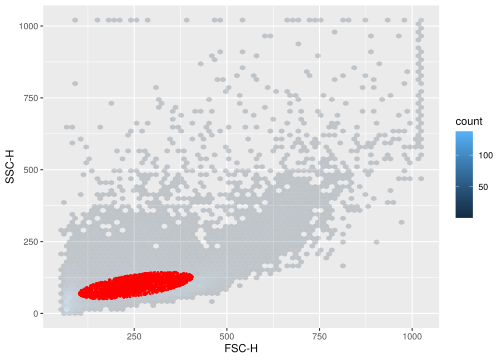

`ggcyto` makes `ggplot2` to be able to work with `Cytometry` data, namely `flowSet/ncdfFlowSet` or `flowFrame` S4 objects.


```r
library(ggcyto)
data(GvHD)
fs <- GvHD[subset(pData(GvHD), Patient %in%5:7 & Visit %in% c(5:6))[["name"]]]
fr <- fs[[1]]
```

## add other gated data as the overlays

```r
p <- ggplot(fr, aes(x = `FSC-H`, y =  `SSC-H`))

# change the smooth color 
myColor <- rev(RColorBrewer::brewer.pal(11, "Spectral"))
myColor_scale_fill <- scale_fill_gradientn(colours = myColor)
# get a gated data
lg <- flowStats::lymphGate(fr, channels=c("FSC-H", "SSC-H"),scale=0.6)
overlay.fr <- Subset(fr, lg)

# add the overlay and dim the background
p1 <- p + stat_binhex(bins = 64, alpha = 0.2)
p1 <- p1 + geom_point(data = overlay.fr, color = "red", cex = 0.5, pch = 19)
p1
```

<!-- -->

```r
# another overlay 
rect.g <- rectangleGate(list("FSC-H" =  c(300,500), "SSC-H" = c(50,200)))
overlay.fr2 <- Subset(fr, rect.g)
p1 + geom_point(data = overlay.fr2, color = "black", cex = 0.5, pch = 19)
```

<!-- -->

```r
# overlay for multiple samples
overlay.fs1 <- Subset(fs, lg)
overlay.fs2 <- Subset(fs, rect.g)
ggplot(fs, aes(x = `FSC-H`, y =  `SSC-H`)) + 
          scale_fill_gradientn(colours = myColor)  +
          stat_binhex(bins = 64, alpha = 0.2) +
          geom_point(data = overlay.fs1, color = "red", cex = 0.5, pch = 19) +
          geom_point(data = overlay.fs2, color = "black", cex = 0.5, pch = 19) +
          facet_grid(Patient ~ Visit)
```

<!-- -->


