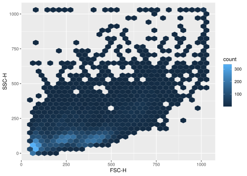
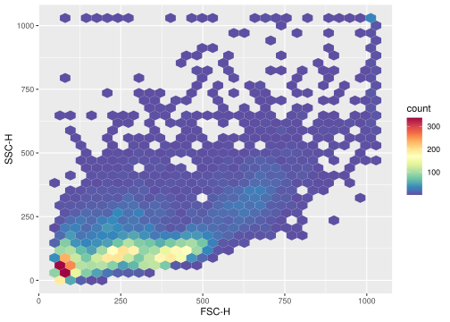
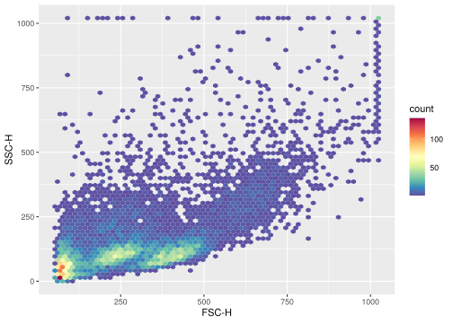
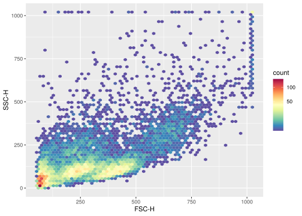
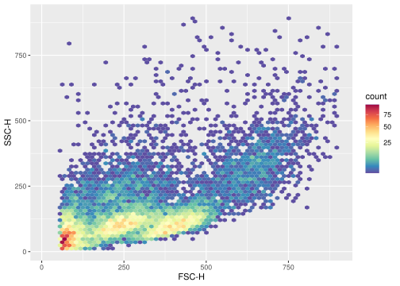
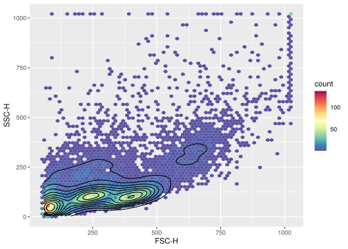
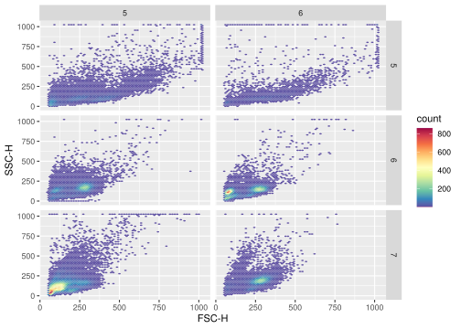
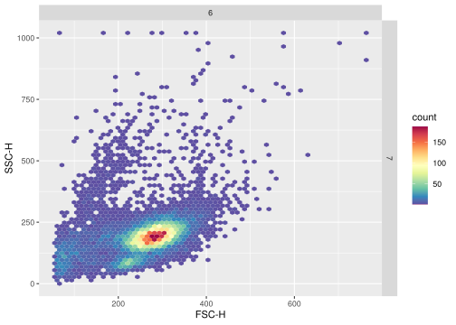
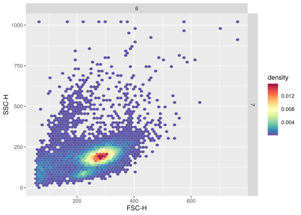

`ggcyto` makes `ggplot2` to be able to work with `Cytometry` data, namely `flowSet/ncdfFlowSet` or `flowFrame` S4 objects.


```r
library(ggcyto)
data(GvHD)
fs <- GvHD[subset(pData(GvHD), Patient %in%5:7 & Visit %in% c(5:6))[["name"]]]
fr <- fs[[1]]
```


```r
# 2d hex
p <- ggplot(fr, aes(x = `FSC-H`, y =  `SSC-H`))
p + stat_binhex()
```

<!-- -->

```r
# change the smooth color 
myColor <- rev(RColorBrewer::brewer.pal(11, "Spectral"))
myColor_scale_fill <- scale_fill_gradientn(colours = myColor)
p + myColor_scale_fill + stat_binhex()
```

<!-- -->

```r
#change the bins
p + myColor_scale_fill + stat_binhex(bins = 64)
```

<!-- -->

```r
# sqr trans binned color
myColor_scale_fill_sqrt <- scale_fill_gradientn(colours = myColor, trans = "sqrt")
p1 <- p + myColor_scale_fill_sqrt + stat_binhex(bins = 64)
p1
```

<!-- -->

```r
# add boundary limits
p1 <- p1 + ylim(c(10,9e2)) + xlim(c(10,9e2))   
p1
```

<!-- -->

```r
# add contour
p <- p + myColor_scale_fill
p + stat_binhex(bins = 64) + geom_density2d(colour = "black")
```

<!-- -->

```r
# non-binned dot plot
df <- fortify(fr)
cols <- densCols(df[,`FSC-H`], df[,`SSC-H`], colramp = flowViz::flowViz.par.get("argcolramp"))
p1 <- ggplot(df, aes(x = `FSC-H`, y =  `SSC-H`))
p1 + geom_point(color = cols) 
```

<!-- -->

```r
# multiple samples
p1 <- ggplot(mapping = aes(x = `FSC-H`, y =  `SSC-H`)) + myColor_scale_fill + facet_grid(Patient~Visit)
p1 + stat_binhex(data = fs, bins = 64)
```

<!-- -->

```r
# color scale is different when plotting single sample
p1 + stat_binhex(data = fs[6], bins = 64)
```

<!-- -->

```r
# display density instead
p1 + stat_binhex(data = fs[6], bins = 64, aes(fill = ..density..))
```

<!-- -->

```r
# the color scale difference is reduced
p1 + stat_binhex(data = fs, bins = 64, aes(fill = ..density..))
```

<!-- -->

```r
# non-binned dot plot
df <- fortify(fr)
cols <- densCols(df[,`FSC-H`], df[,`SSC-H`], colramp = flowViz::flowViz.par.get("argcolramp"))
p <- ggplot(df, aes(x = `FSC-H`, y =  `SSC-H`))
p + geom_point(color = cols) 
```

<!-- -->

