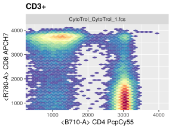
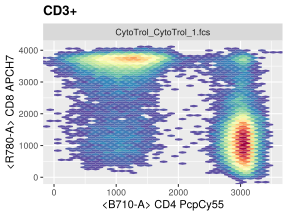
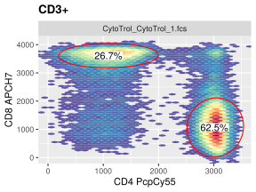
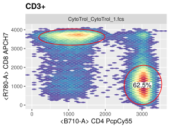
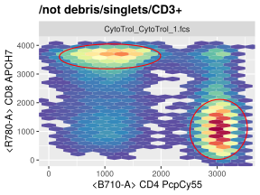
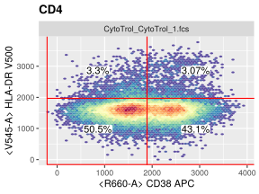
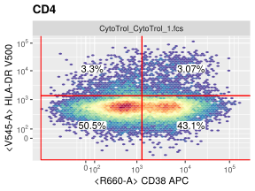

By specifying the dimensions through `aes` and selecting the cell population through `subset`, `ggcyto` can easily visualize the gated data stored in `GatingSet`.

```r
p <- ggcyto(gs, aes(x = CD4, y = CD8), subset = "CD3+") 
# 2d plot 
p <- p + geom_hex(bins = 64)
p
```

<!-- -->

## ggcyto_par_set
We can use the instrument range to automatically filter out these outlier cell events

```r
p + ggcyto_par_set(limits = "instrument")
```

<!-- -->

Or by setting limits manually

```r
myPars <- ggcyto_par_set(limits = list(x = c(0,3.5e3), y = c(-10, 4.1e3)))
p <- p + myPars# or xlim(0,3.5e3) + ylim(-10, 4e3) 
p
```

<!-- -->

To check what kind of visualization parameters can be changed through `ggcyto_par_set`, simply print the default settings

```r
ggcyto_par_default()
```

```
## $limits
## [1] "data"
## 
## $facet
## <ggproto object: Class FacetWrap, Facet, gg>
##     compute_layout: function
##     draw_back: function
##     draw_front: function
##     draw_labels: function
##     draw_panels: function
##     finish_data: function
##     init_scales: function
##     map_data: function
##     params: list
##     setup_data: function
##     setup_params: function
##     shrink: TRUE
##     train_scales: function
##     vars: function
##     super:  <ggproto object: Class FacetWrap, Facet, gg>
## 
## $hex_fill
## <ScaleContinuous>
##  Range:  
##  Limits:    0 --    1
## 
## $lab
## $labels
## [1] "both"
## 
## attr(,"class")
## [1] "labs_cyto"
## 
## attr(,"class")
## [1] "ggcyto_par"
```
## geom_gate
To plot a gate, simply pass the gate name to the `geom_gate` layer

```r
p + geom_gate("CD4")
```

<!-- -->


More than one gate can be added as long as they share the same parent and dimensions

```r
p <- p + geom_gate(c("CD4","CD8")) # short for geom_gate("CD8") + geom_gate("CD4")
p
```

<!-- -->
## geom_stats
By default, stats for all gate layers are added through empty `geom_stats` layer. 

```r
p + geom_stats() + labs_cyto("marker")
```

<!-- -->

Note that we choose to only display marker on axis through `labs_cyto` layer here.

To add stats just for one specific gate, we can pass the gate name to `geom_gate`

```r
p + geom_stats("CD4")
```

<!-- -->

stats type, background color and position are all adjustable.

```r
p + geom_stats("CD4", type = "count", size = 6,  color = "white", fill = "black", adjust = 0.3)
```

<!-- -->

When 'subset' is not specified, it is at abstract status thus can not be visualized 

```r
p <- ggcyto(gs, aes(x = CD4, y = CD8)) + geom_hex() + myPars
p
```

```
## Error in fortify_fs.GatingSet(gs): 'subset' must be instantiated by the actual node name!
## Make sure either 'subset' is specified or the 'geom_gate' layer is added.
```

unless it is instantiated by the gate layer, i.e. lookup the gating tree for the parent node based on the given gates in `geom_gate`

```r
p <- p + geom_gate(c("CD4", "CD8"))
p
```

<!-- -->

## geom_overlay
With `geom_overlay`, you can easily overlay the additional cell populations (whose gates are not defined in the current projection) on top of the existing plot.

```r
p + geom_overlay("CD8/CCR7- 45RA+", col = "black", size = 0.1, alpha = 0.4)
```

<!-- -->

`geom_overlay` automatically determines the overlay type (`goem_point` or `geom_density`) based on the number of dimensions specified in `ggcyto` constructor. 
Note that we change the default `y` axis from `density` to `count` in order to make the scales comparable for the stacked density layers. They are wrapped with `..` because they belong to the `computed variables`.

```r
p <- ggcyto(gs, aes(x = CD4), subset = "CD3+") + geom_density(aes(y = ..count..))
p + geom_overlay("CD8/CCR7- 45RA+", aes(y = ..count..), fill = "red")
```

<!-- -->


## subset
Alternatively, we can choose to plot all children of one specified parent and projections

```r
p <- ggcyto(gs, aes(x = 38, y = DR), subset = "CD4") + geom_hex(bins = 64) + geom_gate() + geom_stats()
p
```

<!-- -->


Or we can add gate layer to any arbitary node instead of its parent node

```r
ggcyto(gs, subset = "root", aes(x = CD4, y = CD8)) + geom_hex(bins = 64) + geom_gate("CD4") + myPars
```

<!-- -->

## axis_x_inverse_trans
Sometime it is helpful to display the axis label in raw scale by inverse transforming the axis without affecting the data

```r
p + axis_x_inverse_trans() + axis_y_inverse_trans()
```

<!-- -->

```r
#add filter (consistent with `margin` behavior in flowViz)
# ggcyto(gs, aes(x = CD4, y = CD8), subset = "CD3+", filter = marginalFilter)  + geom_hex(bins = 32, na.rm = T)
```

