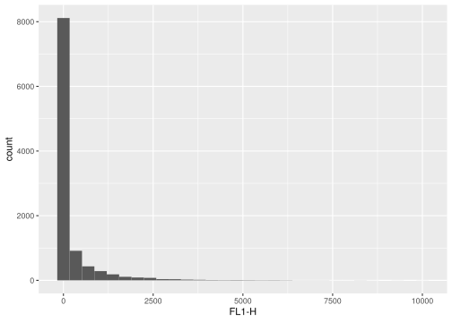

`ggcyto` makes `ggplot2` to be able to work with `Cytometry` data, namely `flowSet/ncdfFlowSet` or `flowFrame` S4 objects.


```r
library(ggcyto)
data(GvHD)
fs <- GvHD[subset(pData(GvHD), Patient %in%5:7 & Visit %in% c(5:6))[["name"]]]
fr <- fs[[1]]
```

## 1d histogram/densityplot

```r
# histogram at raw scale
p <- ggplot(fr, aes(x = `FL1-H`)) 
p + geom_histogram() 
```

<!-- -->

```r
# customize border colors and log scale 
p + geom_histogram(colour = "white") + scale_x_log10()
```

<!-- -->

```r
# change the bin width
p + geom_histogram(colour = "white", binwidth = 1/20) + scale_x_log10()
```

<!-- -->

```r
# logicle scale with default parameters setting (e.g. t = 262144)
p <- p + geom_histogram(colour = "white")
p + scale_x_logicle()
```

<!-- -->

```r
# logicle scale with customized parameter
p + scale_x_logicle(t = 1e4, w = 0)
```

<!-- -->

```r
# customized breaks
myBreaks <- c(0, 10, 1e2, 1e3)
p  + scale_x_logicle(t = 1e4, w = 0, breaks = myBreaks)
```

<!-- -->

```r
# remove marginal events
p  + scale_x_logicle(t = 1e4, w = 0, breaks = myBreaks, limits = c(2, 1e4))
```

<!-- -->

```r
# other scales: flowJo_fasinh, flowJo_biexp
p + scale_x_flowJo_fasinh(t = 1e4)
```

<!-- -->

```r
p + scale_x_flowJo_biexp(maxValue = 1e4, widthBasis = 0)
```

<!-- -->

```r
# save the scales
# myScales <- scale_x_flowJo_biexp(maxValue = 1e4, widthBasis = 0)


# density  (default y is density)
p <- ggplot(fr, aes(x = `FL1-H`)) 
p + geom_density() + scale_x_log10()
```

<!-- -->

```r
# display area
p + geom_area(stat = "density") + scale_x_log10()
```

<!-- -->

```r
# display y as count
p + geom_area(stat = "density", aes(y = ..count..))+ scale_x_log10()
```

<!-- -->

```r
# histogram + density line
ggplot(fr, aes(x = `FL1-H`, y = ..density..)) + geom_histogram(colour = "white") + geom_density(color = "red") + scale_x_log10()
```

<!-- -->

```r
# plot multiple samples
p <- ggplot(fs, aes(x = `FL1-H`)) + geom_area(stat = "density")+ scale_x_log10()
# facetting by sample names
p + facet_wrap(~name) 
```

<!-- -->

```r
# faceeting by other pheno data stored in fs
p + facet_grid(Patient~Visit)
```

<!-- -->

```r
# fill with different colors
ggplot(fs, aes(x = `FL1-H`, fill = name)) + facet_wrap(~name) +  geom_density(alpha = 0.2)+ scale_x_log10()
```

<!-- -->

```r
# or plot in the same panel
ggplot(fs, aes(x = `FL1-H`, fill = name)) + geom_density(alpha = 0.2) + scale_x_log10()
```

<!-- -->

