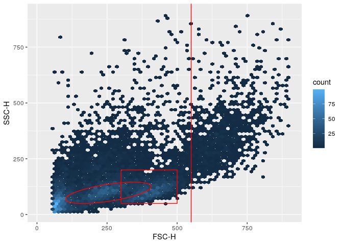
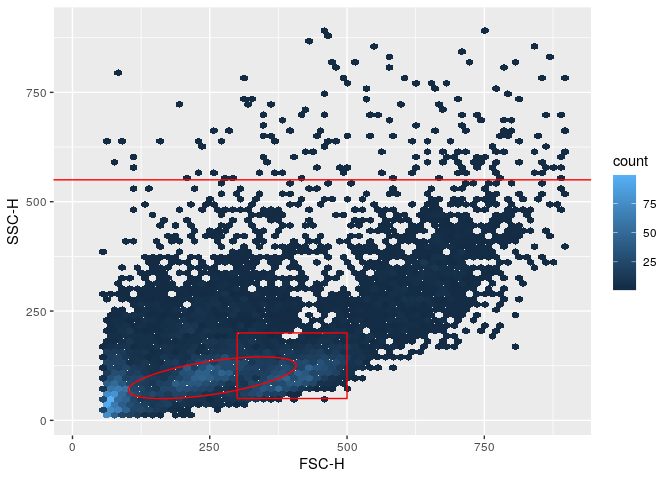
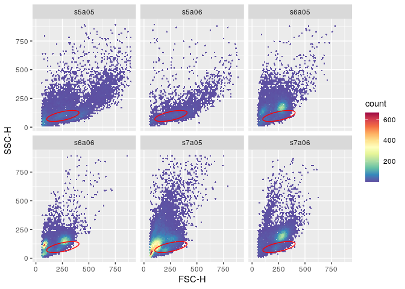
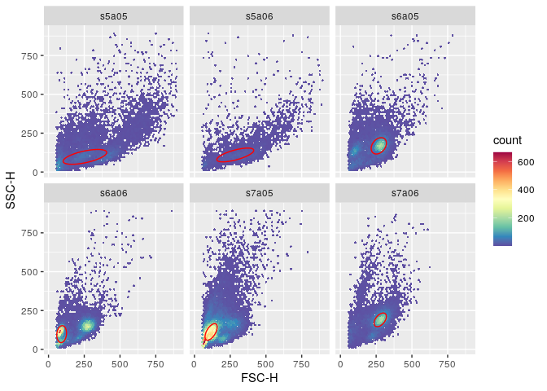
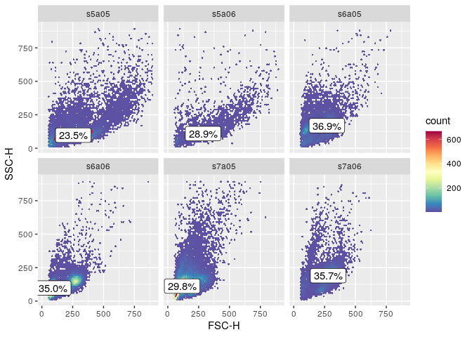
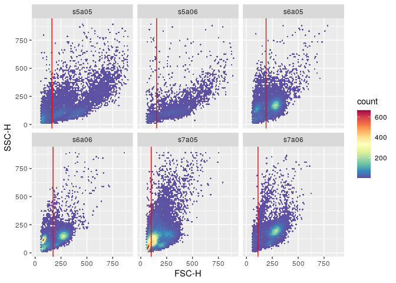
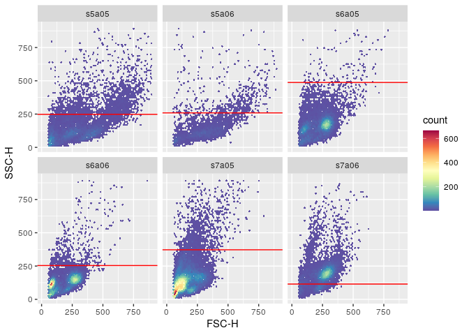
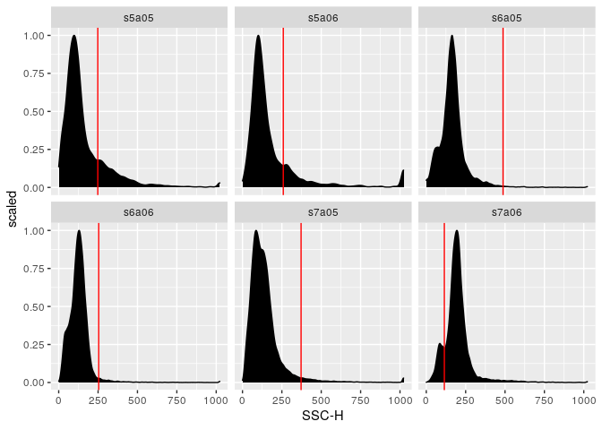

`ggcyto` makes `ggplot2` to be able to work with `Cytometry` data, namely `flowSet/ncdfFlowSet` or `flowFrame` S4 objects.


```r
library(ggcyto)
data(GvHD)
fs <- GvHD[subset(pData(GvHD), Patient %in%5:7 & Visit %in% c(5:6))[["name"]]]
fr <- fs[[1]]
```


```r
# get a lymphGate
lg <- flowStats::lymphGate(fr, channels=c("FSC-H", "SSC-H"),scale=0.6)
p <- ggplot(fr, aes(x = `FSC-H`, y =  `SSC-H`))
p <- p + stat_binhex(bins = 64) + ylim(c(10,9e2)) + xlim(c(10,9e2))   

# add polygonGate layer
p1 <- p + geom_path(data = lg, colour = "red")#can't use geom_gate since it is specialized layer to be used with ggcyto wrapper
p1
```

<!-- -->

```r
# add rectangleGate layer (2d)
rect.g <- rectangleGate(list("FSC-H" =  c(300,500), "SSC-H" = c(50,200)))
p1 <- p1 + geom_polygon(data = rect.g, colour = "red", fill = "transparent")
p1
```

<!-- -->

```r
# add 1d rectangleGate layer (no need for )
rect.g1d <- rectangleGate("FSC-H" =  c(550, Inf))
p1 + geom_hvline(data = rect.g1d, colour = "red") # vline
```

<!-- -->

```r
p1 + geom_hvline(data = rectangleGate("SSC-H" = c(550, Inf)), colour = "red") #hline
```

<!-- -->

```r
# n samples + 1 gate
myColor <- rev(RColorBrewer::brewer.pal(11, "Spectral"))
myColor_scale_fill <- scale_fill_gradientn(colours = myColor)
p <- ggplot(fs, aes(x = `FSC-H`, y =  `SSC-H`)) + myColor_scale_fill + stat_binhex(bins = 64) + ylim(c(10,9e2)) + xlim(c(10,9e2)) + facet_wrap(~name)    
p + geom_path(data = lg, colour = "red")
```

<!-- -->

```r
# n samples + n gates
#fit lymphgate filter to multiple samples
lgs <- lapply(1:length(fs), function(idx) flowStats::lymphGate(fs[[idx]], channels=c("FSC-H", "SSC-H"),scale=0.6))
names(lgs) <- sampleNames(fs)

# add a list of gates as gate layer
# Note: pData must be explicitly attached to geom_gate layer for facetting
lgs <- filterList(lgs)
attr(lgs, "pd") <- pData(fs)
p + geom_path(data = lgs, colour = "red")
```

<!-- -->

```r
# add stats
stats <- compute_stats(fs, lgs, type = "percent")# calculate cell % and ccentroid of the gates
p + geom_path(data = lgs, colour = "red") + geom_label(data = stats , aes(label = value))
```

<!-- -->

```r
# a list of 1d gate
den.gates <- fsApply(fs, openCyto::mindensity, channel = "FSC-H", gate_range = c(100, 300), adjust = 1)
den.gates <- filterList(den.gates)
attr(den.gates, "pd") <- pData(fs)
p + geom_hvline(data = den.gates, colour = "red")
```

<!-- -->

```r
# 1d gate on another dimesion
den.gates <- fsApply(fs, openCyto::mindensity, channel = "SSC-H", gate_range = c(100, 500), adjust = 1)
den.gates <- filterList(den.gates)
attr(den.gates, "pd") <- pData(fs)

# add stats
# stats <- compute_stats(fs, den.gates)# calculate cell % and ccentroid of the gates
# p + geom_hvline(data = den.gates, colour = "red") + geom_label(data = stats , aes(label = value), fill = "yellow")
p + geom_hvline(data = den.gates, colour = "red")
```

<!-- -->

```r
# 1d gate on density plot
p1 <- ggplot(fs, aes(x = `SSC-H`)) + geom_density(aes(y = ..scaled..),fill = "black") + facet_wrap(~name) 
p1 <- p1 + geom_hvline(data = den.gates, colour = "red") 
#must define y aes here since ggplot object does not have y defined in aes
# p1 + geom_label(data = stats , aes(label = value, y = density))
p1
```

<!-- -->


